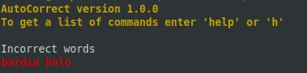
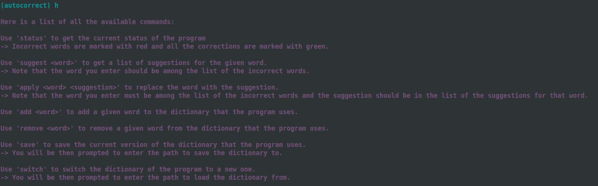
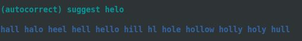
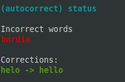
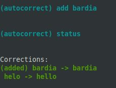
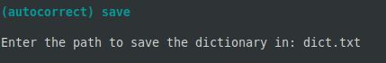
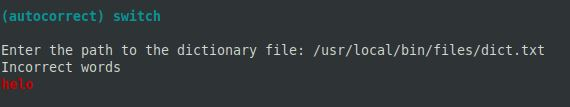

# Terminal Spell Checker

by Bardia Parmoun

Released on: 16/06/2021

## DESCRIPTION
- This program is a simple spell checker for the terminal.
- You can enter your text either through direct input or through a file and the program will run it through its builtin dictionary. 
- This program will be added to your system as a builtin linux command that you can then use anywhere!

## RUNNING THE PROGRAM
- This programs needs to be tested in a Linux environment. 
- Requires a gcc version of 9.3.1 or higher

To build the program and add it as a default command simply run the startup script using:
```shell
$ sudo ./startup.sh
```

 
## USING THE PROGRAM

### Giving an input to the program

You can run either the program by either enterring your text directly or through a file: 

1. Opening the program through direct input 
```
$ autocorrect -c "helo this is bardia"
```

2. Opening the program through the file input
```
$ autocorrect -f /usr/local/bin/files/testfile.txt
``` 

- Note that there is already a testfile located for you under /usr/local/bin/files/

### Different Commands of the Program
- Once you give your input to the program, it will run a scan on your input and it will then give a list of the words in your input. 
<p align="center">

</p>

- You can get a list of the available commands and how to use them by enterring either "h" or "help:
<p align="center">

</p>

- You can get list of suggestions for the incorrect word using the suggest command:
<p align="center">

</p>

- You can then apply that suggestion to the word using the apply command:
```
(autocorrect) apply helo hello
```

- After you run the apply command you can use the status command to get a status of the current state of the program:
<p align="center">

</p>

- If you want to add a given word to a dictionary you can use the add command:
<p align="center">

</p>
You can see that the word was added to the dictionary under status. 

- You can remove a given word from the dictionary using the remove command:
```
remove bardia
```

- You can save the current version of your dictionary using the save command:
<p align="center">

</p>

- You can also switch the current dictionary of the program to a new dictionary using the switch command:
<p align="center">

</p>

Notice that once you load a new dictionary all of your previous changes will be discarded and the program will reanalyze your input. 

## CREDITS
Author: Bardia Parmoun

Copyright © 2021 Bardia Parmoun. All rights reserved